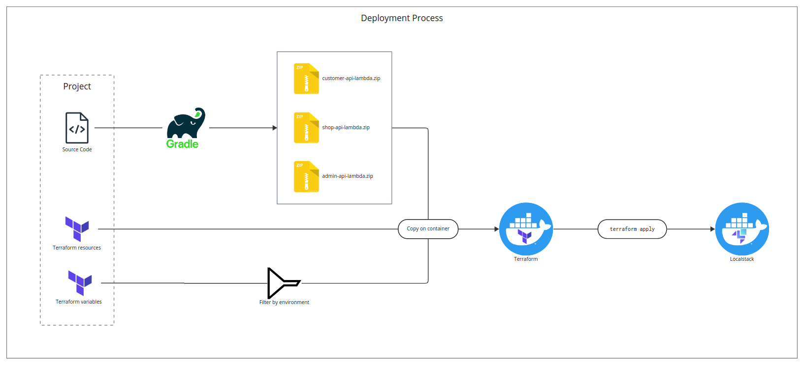
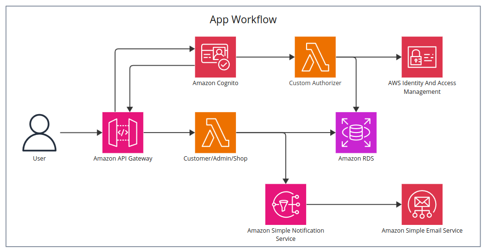
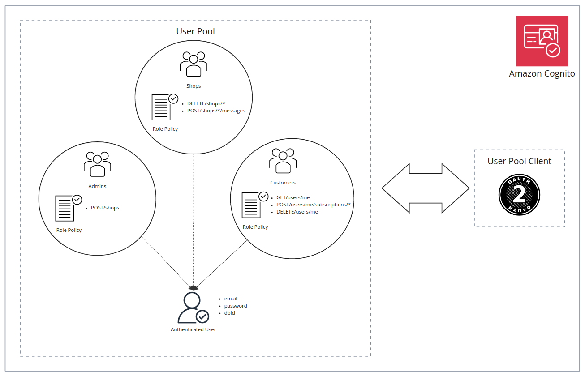
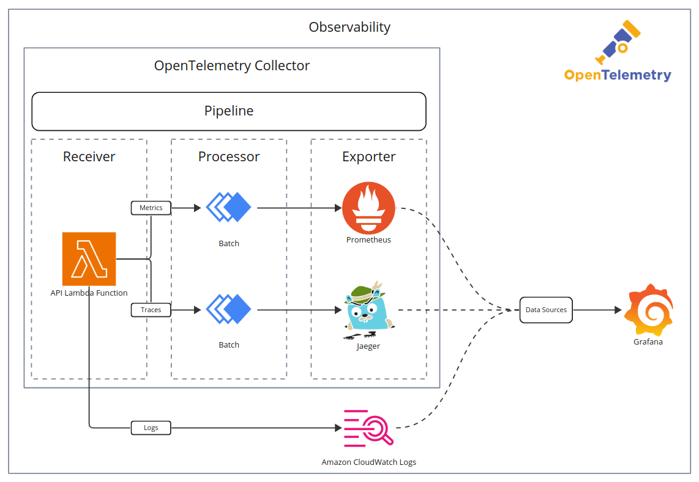
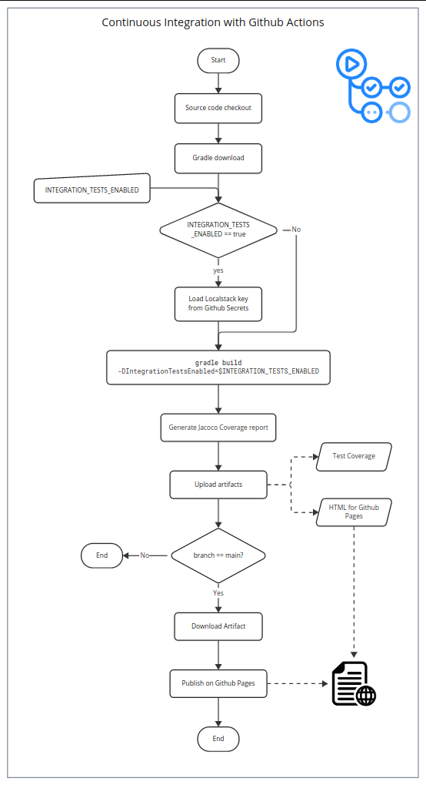

# Sample Project for Local Development with Localstack

This is a sample project that shows how to use some AWS services to create a simple App, and test it using [Localstack](https://www.google.com/url?sa=t&source=web&cd=&cad=rja&uact=8&ved=2ahUKEwizos2yh7eBAxVhSPEDHRF2CU0QFnoECBEQAQ&url=https%3A%2F%2Flocalstack.cloud%2F&usg=AOvVaw3Y-_XGkVayRoxabMtF4Zzn&opi=89978449).

---

## App Description

The app involves customers and shops. A customer wants to be notified when a shop he/she is subscribed to has a new product to show.

A customer can subscribe to a shop using its email and it will receive an email whenever the shop publishes a new message.

The shop is created by an Admin, that is previously contacted by a user, who requests to be the owner of the shop. An admin, can now approve the request and send messages on behalf of the shop. The communication between a user and admin is supposed to happen by email, for instance, so it is not handled through the provided APIs.

Finally, users can delete their account and shop owners can delete the shops as well.

---

## Project Structure

The project is a multi-module application, including the modules:

- `core`: contains the BL and the services that the API are going to call
- `code-coverage-report`: it is necessary to aggregate the code coverage reports from the other modules into a single report using the `jacoco-report-aggregation` plugin
- `cloud`:
  - `admin-api`: the Lambda Function for the Admin APIs
  - `apigateway-authorizer`: the Lambda Function that works as the custom authorizer for Cognito
  - `customer-api`: the Lambda Function for the Customer APIs
  - `infrastructure`: contains the terraform resources to setup the infrastructure and some utility classes for the Lambda modules
  - `initializer`: it is a Lambda function that is executed as soon as the Database is up and running. It creates the DB Tables.
  - `shop-api`: the Lambda Function for the Shop APIs
  - `test-api`: It contains the End-to-End tests of the APIs. This additional module is necessary because it tests many workflows and needs all the Lambda modules as dependencies.

---

## How to run

There are two ways to test the APIs developed:

- **From the Docker Compose** - The compose file spawns one container for Localstack and another for Terraform. Then, by running `make start`, the localstack container is initialized with the defined resources. If the container is already up and you want to apply some changes to the current infrastructure, it is sufficient to run `make tf_apply`.

  To make the deploy faster, two bind mounts are specified:
  - **The Localstack persistence volume** - In this way, Localstack persists all the changes applied to the emulated environment and the next start will be faster
  - **The Terraform state files** - It reflects the current resources that Terraform has applied to the AWS environment. 
- **From the integration tests** - Testcontainer has a module for Localstack that allows to start it for the integration tests, but the procedure is basically the same of the previous way. It is particularly useful for the CI, that is taken care of by Github Actions. The command to run all tests is:

  ```shell
  INTEGRATION_TESTS_ENABLED=true gradle test
  ```
  
Both approaches share the same deployment process, which includes:
1. Building the project and generates the Lambda Function code zips.
2. Creating the Localstack and Terraform containers.
3. Copying the zip files, .tf files and the environment-specific .tfvars files to the Terraform container
4. Running `terraform apply` targeting the Localstack container



---

## Technologies 

Many technologies are involved in this project:

### AWS

- **Lambda Functions**: API Implementation, Custom Authorizer logic and DB seeding
- **S3**: store the Lambda Functions code
- **Api Gateway**: Integrate APIs with Lambdas
- **CloudWatch**: For reading Lambda Logs and Metrics
- **RDS**: To store basic data about users and shops
- **Cognito**: for user authentication/authorization
- **SNS**: used to send notifications to users subscribed to a certain shop when it publishes a new message
- **Secrets Manager**: to store credentials (DB)
- **IAM**: to grant only the necessary privileges to the used services



### API

As for the API implementation, they are written in Java, with the extensive usage of Spring Boot. In particular for the Lambda implementation, I have used Spring Cloud Function, which allows to code a Lambda Function as if it were a `java.util.Function`. Each Java module is then compiled using Gradle, but all the common tasks and dependencies are found in the local Gradle plugin located in `buildSrc/src/main/groovy`. For the DB modeling and seeding I have used `liquibase`. 

APIs are described using the OpenAPI specification, the file is written in YAML and is called `open-api.yml`.

### Testing

Testing is a central point in this project, as I am showing how to run an emulation of AWS locally and in a CI pipeline. In order to do this, we need:

- **Docker**
- **JUnit and Testcontainers**: for unit and integration tests
- **Jacoco** : to analyse the code coverage (which does not include the Lambda Functions coverage)
- **Localstack**: which is the platform that allows to build an emulation of AWS locally
- **Github Actions**: they are basically the CI pipelines. Two pipelines exist:
  - One for the feature branches that stops at the testing step and the generated artifacts include the code coverage report and the Github pages to publish (they are not published here, but only after a push on a `main` branch. By generating them as artifact, the second pipeline does not need to checkout the repository again).
  - One for the `main` branch where the coverage report and the APIs are published on Github Pages

### Others

The infrastructure is built using Terraform to define resources and some shell scripts, placed in the `scripts` folder. A `Makefile` contains all the commands to run the infrastructure with Localstack.

For the observability part, I have used OpenTelemetry APIs and the collector. Metrics are sent to Prometheus, while traces are sent to Jaeger. Grafana can then be used to query these data sources.

---

## User Authentication and Authorization

Users sign up and log in using AWS Cognito. When users are created, they are added to the customer user group. There are 3 user group in the user pool, and these groups correspond to the 3 possible roles in the application: customers, shops, admins. There is currently one admin that is automatically seeded in the user pool (and in the admin group). Every other user assumes the role of customer when signs up, but can gain the "shop" role if the admin creates a shop with him/her as the owner.

User groups are important to define the authorizations a certain user has when calls an API. Everytime a user logs in, he/she receives a OAuth2 token, that has to use in order to call the APIs that requires authentication. Among the claims in the token (both the `accessToken` or `idToken` are valid) the user group is automatically inserted by AWS Cognito. The authorizer, which is a Lambda Function, compares the requested API Arn with the ones that the associated user groups can access to and establish whether to allow or deny the request. A shop owner belongs to both the `customer` group and the `shop` group.

There is another claim in an access token: `dbId`. This claim maps the Cognito user to the corresponding user in the Database. In order to store the basic information about customers and shop, an instance of RDS is used. I have chosen a SQL db because there are just 2 tables and no complex relationships.



---

## Observability

Another important aspect is observability, achieved with the OpenTelemetry tools.

Observability is enabled only when Localstack is run with the Docker-compose, not with automated tests, which verify only the functional aspects. The Docker-compose declares several services for observability:

- otel-collector: it is the Opentelemetry collector that receives metrics/traces/logs from the Lambda Functions and send them to the configured exporters
- prometheus: receives the collector's metrics and the metrics generated by Lambda Functions
- jaeger-all-in-one: receives the traces generated by Lambda Functions
- grafana: can visualize metrics and traces (potentially also logs, but the communication with Localstack failes and is probably not supported yet)

### Lambda Function Observability

To instruct the Lambda Functions to send metrics and traces to the collector, some environment variable must be set:

```shell
OTEL_RESOURCE_ATTRIBUTES = "service.name=${var.function_name},service.namespace=cloud-project"
OTEL_EXPORTER_OTLP_ENDPOINT = "http://otel-collector:4317"
OTEL_SERVICE_NAME = var.function_name
OTEL_TRACES_EXPORTER = "otlp"
OTEL_METRICS_EXPORTER = "otlp"
OTEL_LOGS_EXPORTER = "logging"
```

Metrics and traces are exported using the OLTP protocol to http://otel-collector:4317. This endpoint identifies the otel-collector service and the 4317 port is dedicated to the OLTP messages over gRPC. As for now, logs are just printed to stdout.

OpenTelemetry currently provides two ways to instrument Java code: manual and automatic instrumentation. Automatic instrumentation is very useful because it creates default metrics/spans for most popular libraries, like Spring or AWS calls. As for AWS, it creates a span (or trace if there is no parent trace) for each AWS service called. To enable automatic instrumentation, specify the following Java Agent, that must be included in the Lambda Function archive:

```shell
-javaagent:/var/task/lib/aws-opentelemetry-agent-1.31.0.jar
```

Another approach for automatic instrumentation is to use [special annotation](https://opentelemetry.io/docs/instrumentation/java/automatic/annotations/): each API method defines its own parent span through the `@WithSpan` annotation. The API input is passed as a parameter to the span using the `@SpanAttribute("input")` annotation.

Manual instrumentation offers many more customizations, but it is also more difficult to configure. In this project, there is also an example of manual instrumentations: a `Meter` that produces a metric for the duration of the target methods. These methods are annotated with `@WithMeasuredExecutionTime` and the logic that sends the metric values to the collector is located in an [AspectJ aspect](core/src/main/java/it/unimi/cloudproject/infrastructure/aspects/ExecutionTimeAspect.java). This aspect is woven at post-compile time thanks to the Gradle plugin for AspectJ.



### Grafana Configuration

Grafana is used to analyze the metrics and traces exported to Prometheus and Jaeger, respectively. It is a very flexible tool because it provides a unique interface to analyze the observability signals; it can also be provision with dashboards and data sources. In this project, the data source provisioning consists of a YAML file containing the parameters necessary to connect to the corresponding data sources (see [default.yml](./observability/grafana/provisioning/datasources/default.yml)). Dashboards are provisioned using JSON files. [`prometheus_api_metrics.json`](./observability/grafana/provisioning/dashboards/prometheus_api_metrics.json) contains some panels for the API average execution time.

---

## CI with Github Actions

There are two pipelines:

- Feature branch pipeline: the project is built and tests are run. If the `INTEGRATION_TESTS_ENABLED` variable is set, then the tests with Localstack are executed, otherwise they are disabled. After that, the test coverage is generated and published as an artifact. The HTML for the Github Pages is generated too and published as an artifact.
- Main branch pipeline: the previous pipeline is executed, the artifact for the Github Pages is downloaded and deployed. The HTML is created in the previous pipeline in order to avoid the project checkout in this pipeline as well.

